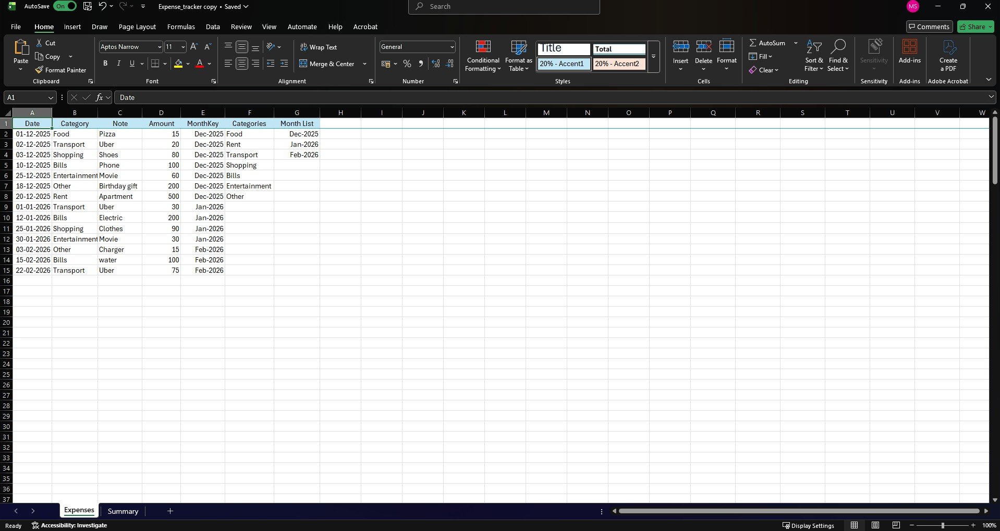
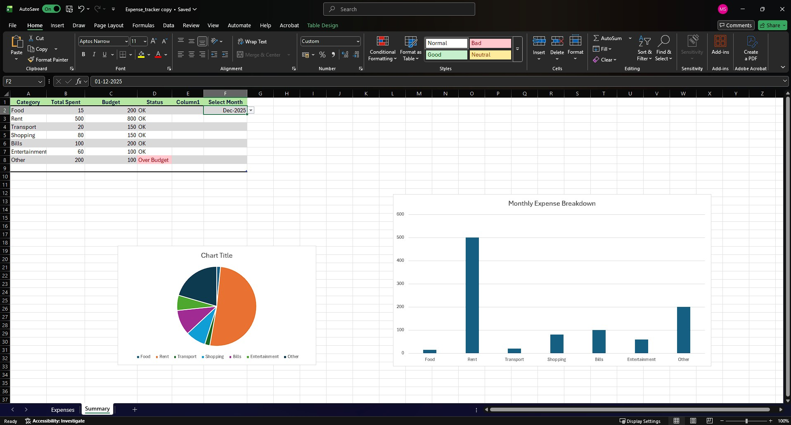
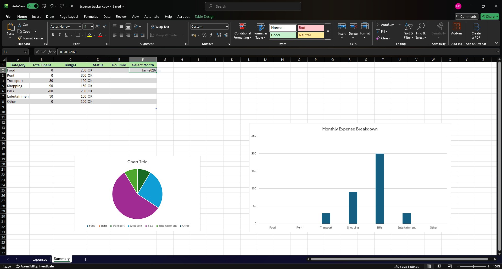
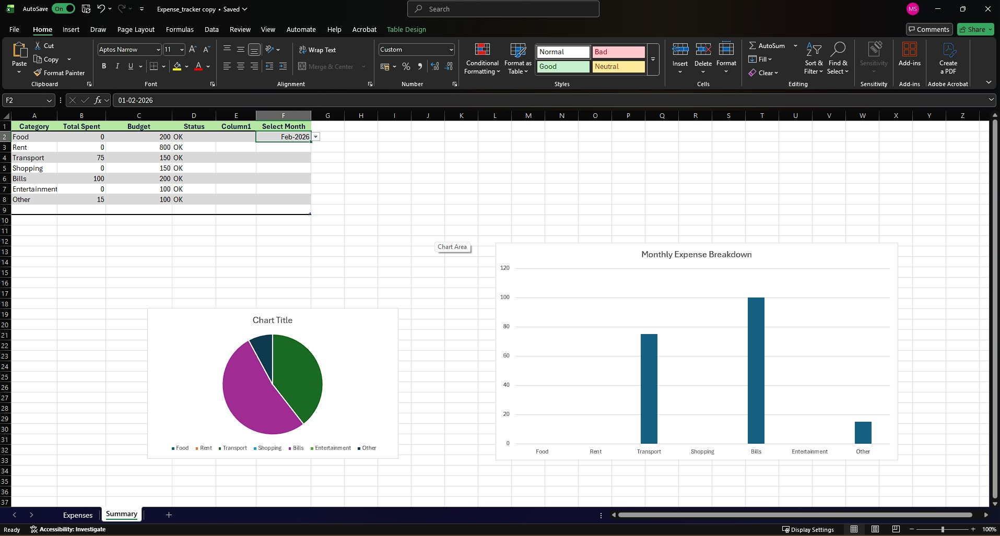

# month-wise-expense-tracker-excel
Excel-based expense tracking dashboard with month-wise analysis, category totals, and charts.
## Overview
This project is a personal expense tracker built entirely using Microsoft Excel.
It allows users to record daily expenses and analyze spending on a month-by-month basis
using interactive formulas and charts.

The project focuses on building strong Excel fundamentals and practical data analysis skills.

## Features
- Daily expense logging with category dropdown
- Month-wise expense analysis using a month selector
- Category-wise total spending calculation
- Budget vs actual comparison with status indicator
- Interactive column chart and pie chart dashboard
- Clean and beginner-friendly Excel structure

## Excel Skills Used
- SUMIF and SUMIFS formulas
- Date handling and month-wise grouping using MonthKey
- Data validation (dropdown lists)
- Conditional logic
- Data visualization using column and pie charts
- Basic data cleaning techniques

## How to Use
1. Enter expenses in the `Expenses` sheet (Date, Category, Amount).
2. Select a month from the dropdown in the `Summary` sheet.
3. View category-wise totals, budget status, and charts for the selected month.
4. Analyze spending patterns visually.

## Learning Outcome
This project helped me understand how to handle dates correctly in Excel,
debug formulas, and create interactive dashboards for financial analysis.

## Screenshots

### Expenses Data Entry Sheet

### Dashboard – December 2025

### Dashboard – January 2026

### Dashboard – February 2026

